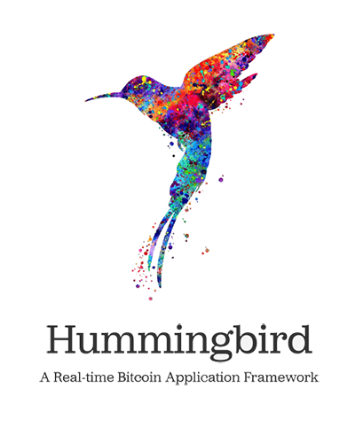

Hummingbird helps you build real-time Bitcoin applications. Optimizing for speed and stability, Hummingbird handles the lower levels between your app and Bitcoin, ensuring your user experiences are always fast and reliable.


* **Connect directly** to a Bitcoin node for speed
* **Receive application data** back quickly as a peer of your own node
* **Scan mempool for transactions** relevant to your application

Hummingbird takes a novel approach to refreshing the mempool, ensuring all transactions are processed quickly. Due to the way peer to peer Bitcoin works, there are sometimes race conditions when asking for the mempool—Hummingbird ensures all transactions come in safely.

*Note: With Hummingbird, your application logic should be able to handle processing a transaction twice. It doesn't happen often, but sometimes you need to re-process old transactions, and a careful use of database indexes and checking error messages can safely ensure your application works as expected. Check the `helpers` file for examples.*


## Install

    npm install hummingbird-bitcoin

## Documentation

Hummingbird enables application state machines to be called while processing transactions.

```javascript
import Hummingbird from "hummingbird-bitcoin"
import { connect } from "./helpers"

const hummingbird = new Hummingbird({
    rpc: { host: "127.0.0.1", user: "root", pass: "bitcoin" },
    peer: { host: "127.0.0.1" },
    from: 600000,
    state_machines: [
        new ApplicationStateMachine(),
    ],
});

class ApplicationStateMachine {
    async onstart() {
        this.db = await connect();
    }

    async ontransaction(tx) {
        await this.db.collection("transactions").insertOne(tx);
    }

    async onrealtime() {
        console.log("block processing has caught up");
    }

    async reset() {
        // useful for testing
    }
}

hummingbird.start();
```


You can stack as many `state_machines` in a Hummingbird instance as you want, and they'll be processed in order, so they can depend on each other.

`onrealtime` is called every time the crawler catches up with crawling blocks and starts reading from the mempool again. It can be useful to have custom logic in here (like clearing the existing mempool).

`ontransaction` is called for every transaction with [TXO](https://github.com/interplanaria/txo) transaction object.

`ontransactions` can be overridden, which allows custom block processing—useful for processing block transactions in a custom order or performing validation logic.

Hummingbird uses a similar `tape.txt` file to keep track of processing, progress can easily be snapshotted, sped up or reversed

```
BLOCK 612452 00000000000000000431d9ea6e33e204223fea64d34cc86ba8c2c5cd0d614c1f 000000000000000004f7ecc52435d31376f5e901d905252d582a0b1a7cbbf577 1575956822
BLOCK 612453 0000000000000000012ca65e1972ab888eddd85c3a65e6e959a61fc424bd6014 00000000000000000431d9ea6e33e204223fea64d34cc86ba8c2c5cd0d614c1f 1575957320
BLOCK 612454 0000000000000000018ea3436231ecf52a27dd51b98781ebe6a1ed13a92916fb 0000000000000000012ca65e1972ab888eddd85c3a65e6e959a61fc424bd6014 1575957865
BLOCK 612455 00000000000000000017d253ff331657bcae1e3d9c3a8e0f24abb10c42f52b4a 0000000000000000018ea3436231ecf52a27dd51b98781ebe6a1ed13a92916fb 1575960245
BLOCK 612456 000000000000000005f9447e5d27dad12348076bfec72f50c2864202f1a5c062 00000000000000000017d253ff331657bcae1e3d9c3a8e0f24abb10c42f52b4a 1575961067
```


## Helpers

Hummingbird has a number of useful helpers that can be used in testing or scripts. Here's an example how you might create a "patcher", a script that can process a block at any height in the blockchain:

```javascript
const log = require("debug")("patcher");
import config from "../config";

import { wait } from "../helpers"

import GenesisStateMachine from "../genesis/state_machine"
import PaymentsStateMachine from "../payments/state_machine"
import ProtocolStateMachine from "../protocol/state_machine"

import Hummingbird from "hummingbird"

if (require.main === module) {
    (async function() {
        const heights = process.argv.slice(2).map(Number);
      
        console.log(`started crawling ${heights.length} heights`);

        const hum = new Hummingbird({
            rpc: { host: "127.0.0.1", user: "root", pass: "bitcoin" },
            peer: { host: "127.0.0.1" },
            tapefile: "patching_tape.txt", // provide a different tape
            state_machines: [
                new GenesisStateMachine(),
                new PaymentsStateMachine(),
                new ProtocolStateMachine(),
            ]
        });

      	// override onconnect, instead of starting crawl from tape, crawl using our heights
        hum.onconnect = async function() {
            for (const height of heights) {
                await hum.crawlblock(height);
            }

          	// afterwards disconnect and don't autoreconnect
            hum.reconnect = false;
            await hum.disconnect();
            console.log(`finished crawling ${heights.length} heights`);
            process.exit();
        };

        hum.start();
    })();
}
```

## Test

    git clone git@github.com:synfonaut/hummingbird.git
    npm install
    npm test

## Author

Created by [@synfonaut](https://twitter.com/synfonaut)

Inspired by [Planaria](https://planaria.network) by [@unwriter](https://twitter.com/_unwriter)

